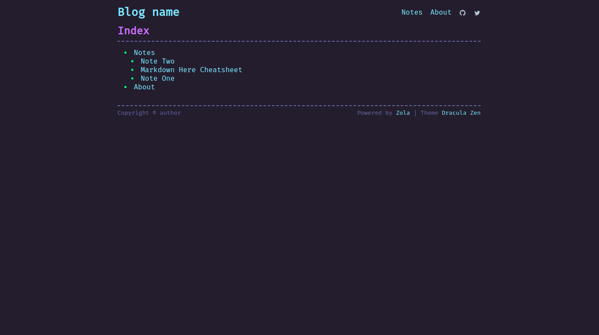

# Dracula Zen

Dracula Zen is a theme for the [Zola](https://www.getzola.org/) static site generator.
This theme is based on [Oceanic-Zen](https://github.com/barlog-m/oceanic-zen).

## Installation

Download theme to your `themes` directory:

```bash
$ cd themes
$ git clone https://github.com/ztroop/dracula-zen.git
```

Or add as git submodule

```bash
$ git submodule add https://github.com/ztroop/dracula-zen.git themes/dracula-zen
```

Enable it in your `config.toml`:

```toml
theme = "dracula-zen"
```

## Options

Theme supported some extra options

```toml
[extra]
author = "blog author name"
github = "github author name"
twitter = "twitter author name"
```

Font [FiraCode](https://github.com/tonsky/FiraCode)

## Screenshots


